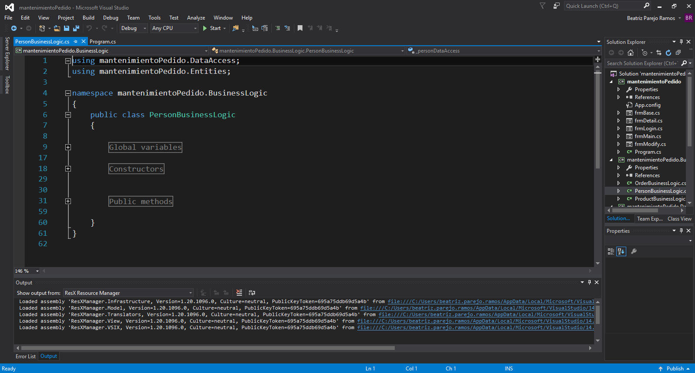
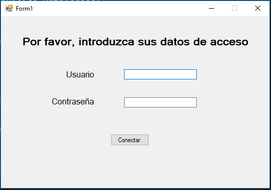
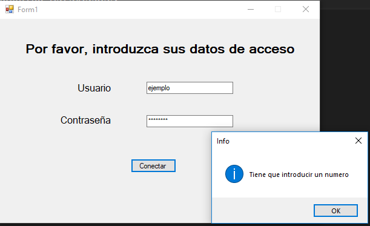
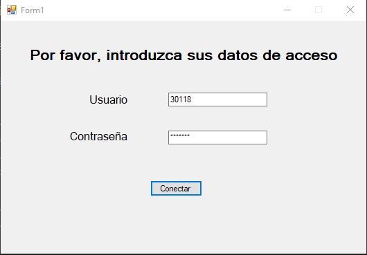
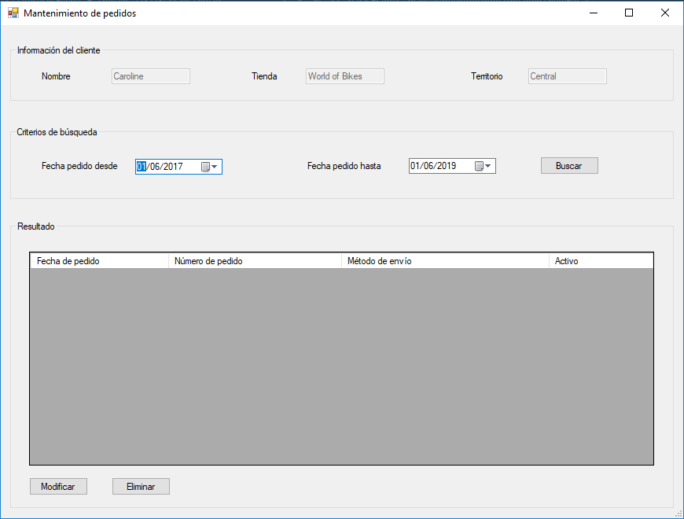
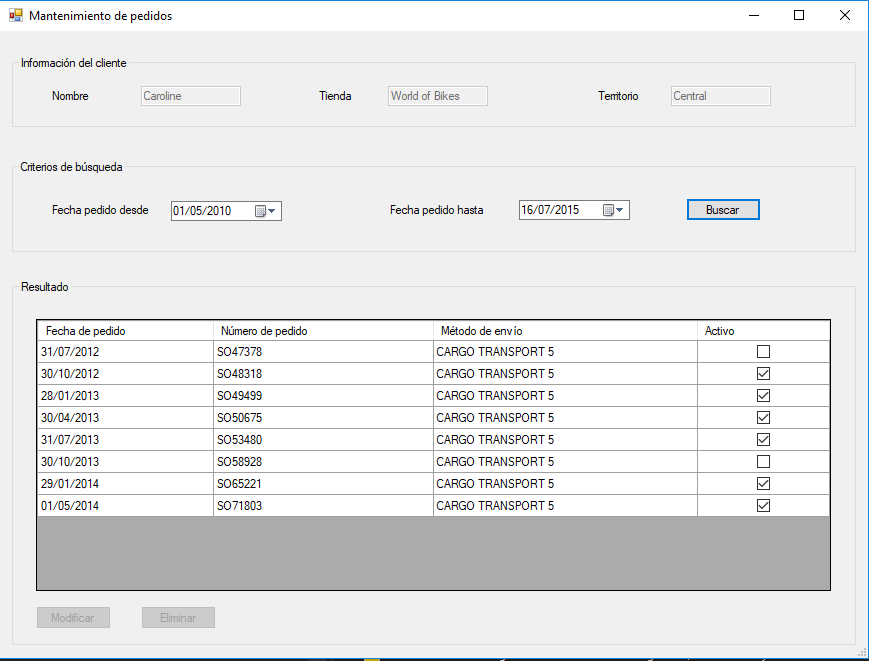
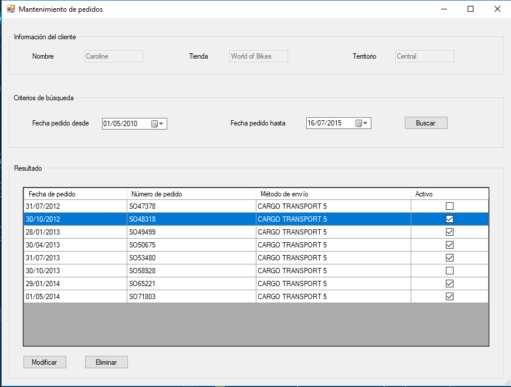
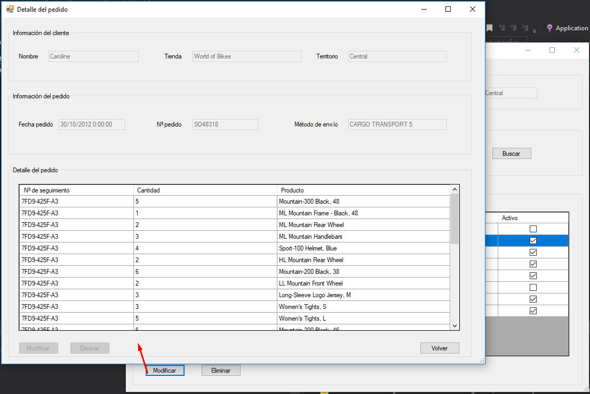
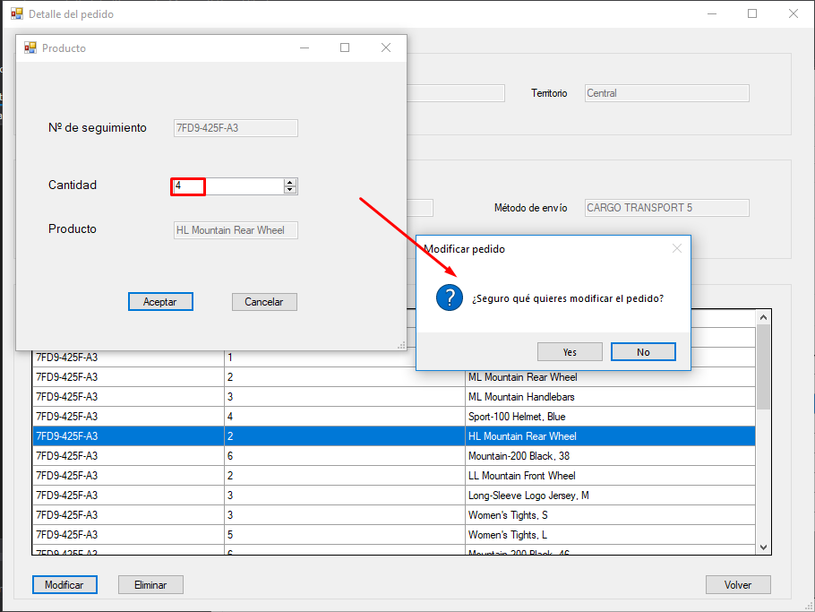
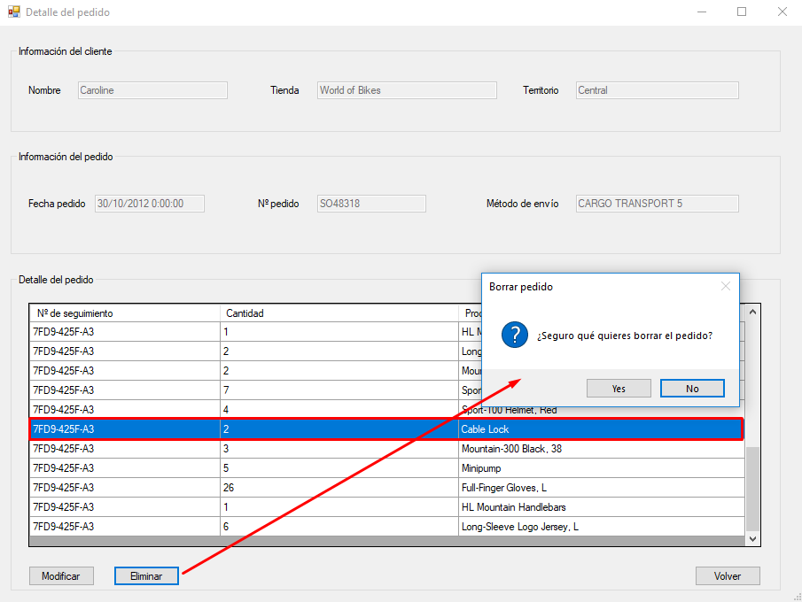

# Presentacion empresa dual
Presentación de la empresa donde he realizado el 1º curso de la dual 

<h1 align="center"> AVANADE </h1>

## Sobre la empresa

Es una empresa internacional que se dedica ofrecer distintos tipos de servicios, desde asesoría, creación de aplicaciones empresariales como soluciones CRM y ERP, soluciones en Cloud, digitalización y servicios tecnológicos.

Sus soluciones empresariales se basan en la plataforma Microsoft Dynamics 365.
Avanade surge en el 2000 fundada entre Acenture y Microsoft. Su principal sede se encuentra en Seattle, Washington, EE.UU. 

Destacar en 2017 el premio a España de Microsoft Partner.

## Formación inicial

He realizado un curso de C# Station a través de la página web C#Station. También, en la misma web realicé el curso de ADO.Net mediante el cual aprendí a incluir bases de datos realizadas en SQL Server al código programado en C# en Visual Studio.
Además de hacer los cursos, he elaborado distintas prácticas llevadas a cabo en consola. Así, programé pequeños ejercicios de bucles, arrays, listas, etc para familiarizarme con el lenguaje y ver las diferencias que hay en c# respecto a java. 

También, he realizado diversos cursos en la plataforma de PluralSight como:

🌸 C# Fundamentals with Visual Studio 2015 (5h 2m)

🌸 C# Best Practices: Collections and Generics (3h 35m)

He visto algunos de los Webcast Innova Learn que se han ofrecido en la empresa como por ejemplo uno sobre GitHub y otro de Docker en Microsoft Azure

## Prácticas

He llevado a cabo diversas prácticas en consola y más tarde desarrollando una aplicación en WinForm con la base de datos de AdventureWorks que proporciona Microsoft de forma gratuita. De esta forma he podido realizar prácticas también con SQL, elaborando tareas de creación, actualización, insercción y borrado de datos, además de realozar diversas consultas.

## Herramientas y tecnologías utilizadas

🌸 C#

🌸 SQL

🌸 Visual Studio

🌸 Visual Studio Microsoft SQL Server Management Studio

## Aplicación realizada con WinForm

Aplicación que gestiona pedidos de usuarios con la base de datos de AdventureWorks

